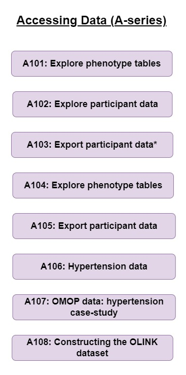

# **Accessing phenotypic data on the UK Biobank Research Analyses Platform**

The A-series (**Accessing Data**) notebooks found in this repository focus on performing basic operations to access and examine UKB phenotypic data. These give an overview of how to link and manipulate the phenotypic databases on the RAP that are likely to be interfaced with the genomic (or other; e.g. imaging) resources. Some of the data files outputted from these A-series notebooks are required for the main analytical repositories found elsewhere on these pages.

In order to initiate these notebooks on the RAP please see instructions at the bottom of this page.

### 

### Please note

-   When working with phenotypic data a Spark cluster is often required (see *Table of Contents* for guidance)

-   Always terminate a kernel before starting a new notebook

### 

## **Table of contents**

A101 Explore phenotype tables (language = Python; instance = Spark)

A102 Explore participant data (Python; Spark)

A103 Export participant data (Python; Spark)

A104 Explore phenotype tables (R; Single Node)

A105 Export participant data to R (R; Spark)

A106 Hypertension data (R; Spark)

A107 OMOP data: hypertension case-study (R; Spark)

A108 Constructing the OLINK dataset (R; Spark)

## **Python and R libraries**

### The following Python libraries are required (guidance on installation found within Notebooks):

*scipy; dxdata; matplotlib.pyplot; numpy; openpyxl; os; pandas; seaborn*

### The following R libraries are required:

*BSgenome.Hsapiens.UCSC.hg38; GenomicRanges; SNPlocs.Hsapiens.dbSNP155.GRCh38; TxDb.Hsapiens.UCSC.hg38.knownGene; VariantAnnotation; VennDiagram; arrow; bigparallelr; bigsnpr; dplyr; dxdata; ggplot2; gprofiler2; grid; hexbin; parallel; readr; readxl; reticulate; scales; skimr; tidyr; tidyverse; sparklyr; data.table; stringr; glue; DBI; purrr; bit64*

# **Notebooks details**

## A101 Explore phenotype tables (Python; Spark)

**Scope:** This notebook explains how to connect to the phenotypic database and retrieve information about available tables (using Python). It describes the basics of connecting to phenotype databases and exploring tables and fields. We will use a `dxdata.connect` function to initiate a connection to the database. Next, we will learn how to obtain the project and dataset IDs required to load a dataset. We will iteratively throw the tables in the dataset and obtain a short description of each table. Finally, we will retrieve the information from one of these tables to local memory, inspect the content, and print a few rows of the data.

**Notebook file:** A101_Explore-phenotype-tables_Python.ipynb

**Dependency**

-   A Spark instance

**Run info:**

-   runtime: 5min

-   recommended instance: mem1_ssd1_v2_x8

-   cost: \<£0.10

## A102 Explore participant data (Python; Spark)

**Scope:** This notebook explains how to explore phenotypic data table and retrieve fields. We will dive deeper into the phenotypic data stored in the Spark database. We will retrieve the information about the fields, and learn how to get a field id, title, and link to the UK Biobank Showcase, which provides more details and basic statistics about fields.

**Notebook file:** A102_Explore-participant-data_Python.ipynb

**Dependency**

-   A Spark instance

**Run info:**

-   runtime: 10min

-   recommended instance: mem1_ssd1_v2_x8

-   cost: \<£0.10

## A103 Export participant data (Python; Spark)

**Scope:** Retrieve fields from phenotypic table and export them to CSV and XLSX files. In this notebook, we will combine commands and routines from previous notebooks.The goal is to find and retrieve selected fields from the phenotype database. Then we will export this data to CSV and Excel files - this is useful for further analyses and necessary for creating input files for tools like PLINK and REGENIE. Further information can be found in Research Analysis Platform documentation: <https://dnanexus.gitbook.io/uk-biobank-rap/working-on-the-research-analysis-platform/using-spark-to-analyze-tabular-data>

**Notebook file:** A103_Export-participant-data_Python.ipynb

**Dependency**

-   A Spark instance

**Run info:**

-   runtime: 10min

-   recommended instance: mem1_ssd1_v2_x8

-   cost: \<£0.10

## A104 Explore phenotype tables (R; Single Node)

**Scope:** This notebook shows how to connect to the Spark database in R. This notebook describes the basics of connecting to phenotype databases and exploring tables and fields. We will use the `reticulate` R package to connect to Python and call the `dxdata.connect` function, which connects to the Spark database. Next, we will learn how to convert Python (data frames) objects to R objects (tibble) and work with them using `dplyr` package. We will browse available tables and get a short description of each. Finally, we will iteratively throw all field descriptors in the `participant` table, retrieve the file codings, and save all this information to a CSV file.

**Notebook file:** A104_Explore-phenotype-tables_R.ipynb

**Dependency**

-   **NA**

**Run info:**

-   runtime: 15min

-   recommended instance: mem1_ssd1_v2_x8

-   estimated cost: \<£0.20

## A105 Export participant data to R (R; Spark) git init

**Scope:** This notebook shows how to retrieve and export phenotypic data in R and explains how to retrieve and save phenotypic data for further analyses, such as genome-wide association studies or epidemiological studies. We will use the `reticulate` R package to connect to Python and call the `dxdata.connect` function, which connects to the Spark database. Next, we will convert a Python (Spark data frame) object to an R object (tibble) and export data to a tabular text file. This file can be used as an input to external tools, such as PLINK or REGENIE.

**Notebook file:** A105_Export-participant-data_R.ipynb

**Dependency**

-   A Spark instance

**Run info:**

-   runtime: 10min

-   recommended instance: mem1_ssd1_v2_x8

-   estimated cost: \<£0.15

## A106 Hypertension data (R; Spark)

**Scope:** This notebook is a more advanced version of notebook **A105** "Export participant data to R". In addition to fetching phenotypic data, we will investigate how to work with different sources and types of phenotypic data. The goal is to retrieve phenotypic annotations that we will use to perform GWAS (notebook **G203**) and PRS (notebook **G205**) studies of hypertension. We will use four sources:

-   Non-cancer illness code, self-reported

-   Diagnoses - ICD10

-   Underlying (primary) cause of death

-   Blood pressure measurement during the interview (systolic and diastolic)

Next, we examine and visualize the data -- the empirical probability densities for systolic and diastolic blood pressures for self-reported hypertension vs. non-affected and systolic and diastolic as scatter plots with the colour-coded condition. We will also apply CDC blood pressure level cut-offs to find which patients measured above the high blood pressure (hypertension) threshold during the interview. Next, we will visualise the overlap between three sources of information (self-reported, ICD10 diagnoses and diastolic blood pressure) on the Venn diagram. Finally, we will prepare tabular file formats that will be input for further analyses.

**Notebook file:** A106_Hypertension-data_R.ipynb

**Dependency**

-   A Spark instance

**Run info:**

-   runtime: 20min

-   recommended instance: mem1_ssd1_v2_x16

-   estimated cost: \<£0.30

## A107 OMOP data: hypertension case-study (R; Spark)

**Scope:** This notebook performs similar analysis to Notebook **A106**. In addition to analysing hypertension within OMOP data, we will investigate how different OMOP tables interact and how to use spark within R to perform analysis on large tables. The Observational Health Data Science and Informatics community developed the Observational Medical Outcomes Partnership (OMOP) Common Data Model, which is a standardised healthcare data model. OMOP is designed to standardise the structure and content of observational data and enable efficient analyses. The goal of the notebook is to demonstrate methods described for finding, extracting, and classifying hypertension data from the OMOP data. This notebook uses three sources: 

- OMOP condition occurrence 
- OMOP Person
- OMOP concept resources

**Notebook file:** A107_OMOP-data-hypertension-case-study_R.ipynb

**Dependency**

-   A Spark instance

**Run info:**

-   runtime: 10min

-   recommended instance: mem1_ssd1_v2_x16

-   cost: \<£0.10

## A108 Constructing the OLINK dataset (R; Spark)

**Scope:** This notebook demonstrates how to extract all the Olink instance tables, relevant  resources and data fields and how to join them all together to create a single dataset using R.

**Notebook file:** A108_Constructing-the-Olink-dataset_R.ipynb

**Dependency**

-   **NA**

**Run info:**

-   runtime: 15min

-   recommended instance: mem1_hdd1_v2_x8

-   cost: \<£0.30

### 

# How to run Jupyter notebooks on the RAP

Follow the steps below to run this Jupyter Notebook:

-   Login to the RAP: https://ukbiobank.dnanexus.com/panx/projects
-   Click on the Tools menu and select "JupyterLab"
-   Click on the "New JupyterLab" button to start a JupyterLab instance.
-   Select a name and a project from the dropdown menu for your JupyterLab environment.
-   Select the priority for your JupyterLab environment; "High" is recommended.
-   Under "Cluster Configuration", select "Single Node" or "Spark" according to requirements listed in *Table of Contents*.
-   Set instance type (e.g. mem1_sdd1_v2_x16) and duration for you environment. See individual notebooks for recommendations.
-   Click on "Start Environment"
-   You will see your environment go from "Initialising" to "Launching" and then "Ready". This may take some time depending on the priority selected; at busy times, it may be necessary to select high priority to avoid long initialising times. Once the environment is ready, click on "Open".
-   A JupyterLab session will open. On the left side of the screen, you will see a a "DNA Nexus" tab, allowing you to open notebooks directly from your project environment. If you have saved this notebook under you project environment, just double click to open it.
-   Press "Ctrl" + "Enter" to run code cells. An hourglass icon on the JupyterLab tab in your browser indicates that the code is running. Please note that depending on number of chromosomes and SNPs and your instance type, code may take some time to run.
