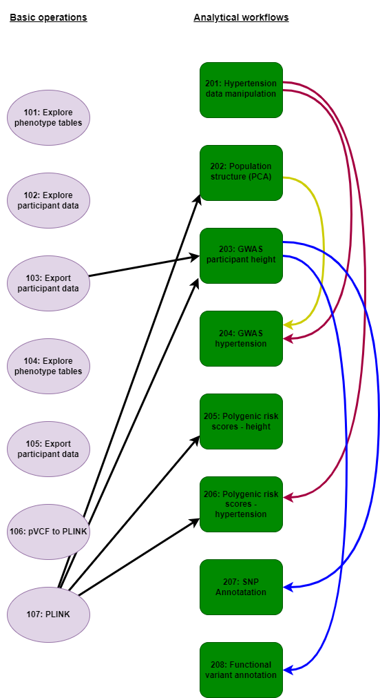

# UK Biobank Research Analyses Platform examples

This repository provides a collection of examples of how to use UK Biobank Research Analyses Platform (RAP). The examples fall into three categories Jupyter notebooks, interactive R/Shiny Apps, and container apps.

The notebooks are also divided into complete analytical workflows which are supported by introductory notebooks outlining basic operations for accessing data on the RAP, and producing data files that are required for specific analyses.

We recommend beginning with the basic operations notebooks. These give an overview of how to link and manipulate the phenotypic databases on the RAP that are likely to be interfaced with the genomic resource. The final notebook in this series demonstrates how to filter PLINK formatted joint call files in order that subsequent analyses may be undertaken. From here the main body of notebooks illustrate how to perform many standard analyses (e.g, GWAS, population genomics, functional annotation) that are typically employed in bioinformatic studies. Many notebooks are interdependent relying on previously generated phenotypic and genotypic files for execution, with figure 1 indicates the relationships between notebooks. For example, if you feel comfortable jumping in to the main body of analytical notebooks (e.g., to perform GWAS), figure 1 indicates which previous notebooks are required to produce all the requisite input files.

In order to instigate these notebooks on the RAP please see instructions at the bottom of this page.

Please note, notebook **107** is a key component of many subsequent analyses. It takes several hours to run as it processes the first eight chromosomes of final release joint call PLINK formatted files. It can be sped up to only process fewer files, e.g., the last three smaller chromosmes (20-22). The only downside to this is that occasional downstream analyses will not generate significant results. Please see comments in **107** for instruction if you wish to change code for quicker file processing.

### 

### Please note

-   When working with phenotypic data a Spark cluster should be used (see *Table of Contents* for guidance)

-   Always terminate a kernel before starting a new notebook

### 

# Table of contents

**Basic operations**

101 Explore phenotype tables (language = Python; instance = Spark)

102 Explore participant data (Python; Spark)

103 Export participant data (Python; Spark)

104 Explore phenotype tables (R; Single Node)

105 Export participant data to R (R; Spark)

106 UKB pipeline pVCF to PLINK (Bash; Single Node)

107 Merging, converting and filtering variant data using PLINK (Bash; Single Node)

### 

**Analytical workflows**

201 Visualising and downloading hypertension participant data (R; Spark)

202 Population structure (PCA) ethnicity (R; Spark)

203 GWAS participant height (R; Single Node)

204 GWAS hypertension (R; Single Node)

205 Polygenic risk scores of participant height (R; Single Node)

206 Polygenic risk scores for hypertension (R; Single Node)

207 Annotate SNPs from dbSNP and profile ontologies (R; Single Node)

208 Functional annotations of variants (R; Single Node)

### 

# Python and R libraries

### The following Python libraries are required (guidance on installation found within Notebooks):

*scipy; dxdata; matplotlib.pyplot; numpy; openpyxl; os; pandas; seaborn*

### The following R libraries are required:

*BSgenome.Hsapiens.UCSC.hg38; GenomicRanges; SNPlocs.Hsapiens.dbSNP155.GRCh38; TxDb.Hsapiens.UCSC.hg38.knownGene; VariantAnnotation; VennDiagram; arrow; bigparallelr; bigsnpr; dplyr; dxdata; ggplot2; gprofiler2; grid; hexbin; parallel; readr; readxl; reticulate; scales; skimr; tidyr; tidyverse*

# Notebooks details

## 101 Explore phenotype tables (Python; Spark)

**Scope:** This notebook explains how to connect to the phenotypic database and retrieve information about available tables (using Python). It describes the basics of connecting to phenotype databases and exploring tables and fields. We will use a `dxdata.connect` function to initiate a connection to the database. Next, we will learn how to obtain the project and dataset IDs required to load a dataset. We will iteratively throw the tables in the dataset and obtain a short description of each table. Finally, we will retrieve the information from one of these tables to local memory, inspect the content, and print a few rows of the data.

**Notebook file:** 101_explore_phenotype_tables.ipynb

**Dependency**

-   **A Spark instance**

**Run info:**

-   runtime: 5min

-   recommended instance: mem1_ssd1_v2_x8

-   cost: \<£0.10

## 102 Explore participant data (Python; Spark)

**Scope:** This notebook explains how to explore phenotypic data table and retrieve fields. We will dive deeper into the phenotypic data stored in the Spark database. We will retrieve the information about the fields, and learn how to get a field id, title, and link to the UK Biobank Showcase, which provides more details and basic statistics about fields.

**Notebook file:** 102_explore_participant_data.ipynb

**Dependency**

-   **A Spark instance**

**Run info:**

-   runtime: 10min

-   recommended instance: mem1_ssd1_v2_x8

-   cost: \<£0.10

## 103 Export participant data (Python; Spark)

**Scope:** Retrieve fields from phenotypic table and export them to CSV and XLSX files. In this notebook, we will combine commands and routines from previous notebooks.The goal is to find and retrieve selected fields from the phenotype database. Then we will export this data to CSV and Excel files - this is useful for further analyses and necessary for creating input files for tools like PLINK and REGENIE. Further information can be found in Research Analysis Platform documentation: <https://dnanexus.gitbook.io/uk-biobank-rap/working-on-the-research-analysis-platform/using-spark-to-analyze-tabular-data>

**Notebook file:** 103_export_participant_data.ipynb

**Dependency**

-   **A Spark instance**

**Run info:**

-   runtime: 10min

-   recommended instance: mem1_ssd1_v2_x8

-   cost: \<£0.10

## 104 Explore phenotype tables (R; Single Node)

**Scope:** This notebook shows how to connect to the Spark database in R. This notebook describes the basics of connecting to phenotype databases and exploring tables and fields. We will use the `reticulate` R package to connect to Python and call the `dxdata.connect` function, which connects to the Spark database. Next, we will learn how to convert Python (data frames) objects to R objects (tibble) and work with them using `dplyr` package. We will browse available tables and get a short description of each. Finally, we will iteratively throw all field descriptors in the `participant` table, retrieve the file codings, and save all this information to a CSV file.

**Notebook file:** 104_explore_phenotype_tables_r.ipynb

**Dependency**

-   **NA**

**Run info:**

-   runtime: 15min

-   recommended instance: mem1_ssd1_v2_x8

-   estimated cost: \<£0.20

## 105 Export participant data to R (R; Spark)

Scope: This notebook shows how to retrieve and export phenotypic data in R and explains how to retrieve and save phenotypic data for further analyses, such as genome-wide association studies or epidemiological studies. We will use the `reticulate` R package to connect to Python and call the `dxdata.connect` function, which connects to the Spark database. Next, we will convert a Python (Spark data frame) object to an R object (tibble) and export data to a tabular text file. This file can be used as an input to external tools, such as PLINK or REGENIE.

**Notebook file:** 105_export_participant_data_to_r.ipynb

**Dependency**

-   **A Spark instance**

**Run info:**

-   runtime: 10min

-   recommended instance: mem1_ssd1_v2_x8

-   estimated cost: \<£0.15

## 106 UKB pipeline pVCF to PLINK (Bash; Single Node)

**Scope:** This notebook shows how to interact with genomic data in bed/bim/bam format using PLINK 2.0. We will learn how to convert between PLINK 1.x and PLINK 2.x file formats, merge variants from different chromosomes into a single file and filter them based on variant completeness and mean allelic frequencies (MAF). Please note the extended runtime of this notebook and that no subsequent analyses are contingent on its outputted files.

**Notebook file:** 106_UKB_pipeline_pVCF_to_PLINK.ipynb

**Dependency**

-   **PLINK install**

**Run info:**

-   runtime: 4hrs

-   recommended instance: mem1_ssd1_v2_x16

-   estimated cost: \<£1.50

### 

## 107 Merging, converting and filtering variant data using PLINK (Bash; Single Node)

Scope: This notebook shows how to interact with genomic data in bed/bim/bam format using PLINK 2.0. We will learn how to convert between PLINK 1.x and PLINK 2.x file formats, merge variants from different chromosomes into a single file and filter them based on variant completeness and mean allelic frequencies (MAF). This process filters and then merges all the chromosomes into one file. More filters, prior to merging will likely speed this process.

**Notebook file:** 107_merging_converting_and_filtering_variant_data_using_PLINK.ipynb

**Dependency**

-   **PLINK install**

**Run info:**

-   runtime: 12 hours

-   recommended instance: mem1_ssd1_v2_x16

-   estimated cost: \<£1.50

## 

## 

### 201 Visualising and downloading hypertension participant data (R; Spark)

**Scope:** Building on notebook **105** we will retrieve, visualise and organise phenotypic data for high blood pressure studies

**Notebook file:** 201_find_and_export_hypertension_participant_data_r.ipynb

**Dependency**

-   **A Spark instance**

**Run info:**

-   runtime: 20min

-   recommended instance: mem1_ssd1_v2_x16

-   estimated cost: \<£0.30

This notebook is a more advanced version of notebook **105** "Export participant data to R". In addition to fetching phenotypic data, we will investigate how to work with different sources and types of phenotypic data. The goal is to retrieve phenotypic annotations that we will use to perform GWAS (notebook **204**) and PRS (notebook **206**) studies of hypertension. We will use four sources:

-   Non-cancer illness code, self-reported

-   Diagnoses - ICD10

-   Underlying (primary) cause of death

-   Blood pressure measurement during the interview (systolic and diastolic)

Next, we will examine and visualize the data -- the empirical probability densities for systolic and diastolic blood pressures for self-reported hypertension vs. non-affected and systolic and diastolic as scatter plots with the colour-coded condition. We will also apply CDC blood pressure level cut-offs to find which patients measured above the high blood pressure (hypertension) threshold during the interview. Next, we will visualise the overlap between three sources of information (self-reported, ICD10 diagnoses and diastolic blood pressure) on the Venn diagram. Finally, we will prepare tabular file formats that will be input for further analyses.

## 202 Population structure (PCA) ethnicity (R; Spark)

**Scope:** This notebook show how to retrieve phenotype data, load genotype data and perform Principal Component Analysis (PCA) with packages bigstatsr and bigsnpr (Privé, Aschard, and Blum 2017). Additionally, it demonstrates why pruning and removing long-range Linkage Disequilibrium (LD) are two important steps before computing PCs in order to capture population structure (Abdellaoui et al. 2013).

**Notebook file:** 202_population_structure_PCA_ethnicity.ipynb

**Dependency:**

-   **A Spark instance**

<!-- -->

-   **107** - files prefixed *maf_flt_8chroms\**

**Run info:**

-   runtime: 30min

-   recommended instance: mem1_ssd1_v2_x16

-   cost: \~£0.70

## 203 GWAS participant height (R; Single Node)

**Scope:** We will use phenotypes produced by notebook **103**. This includes three sources of information about participant's high blood pressure status: self-reported, ICD10 diagnoses and systolic blood pressure cut-offs, as well as values of blood pressure measurement. The phenotype data file also includes the `eid` identifier column, which allows us to match the rows in the `phenotype` table to corresponding genotypes saved in PLINK format. We will use linear and logistic models required for GWAS analyses using `bigstatsr` and `bigsnpr` packages (Privé, Aschard, and Blum 2017) in R.

**Notebook file:** 203_example_GWAS_participant_height.ipynb

**Dependency:**

-   **103** - file *pheno_height_sex_age_500k.xlsx*

-   **107** - *maf_flt_8chroms*\* prefixed files

**Run info:**

-   runtime: 30min

-   recommended instance: mem1_ssd1_v2_x16

-   cost: \~£0.70

## 204 GWAS hypertension (R; Single Node)

**Scope:** This notebook is a more advanced version of the GWAS workflow presented in notebook **203**. We will use phenotypes produced by **Notebook 201**. This includes three sources of information about participant's high blood pressure status: self-reported, ICD10 diagnoses and systolic blood pressure cut-offs, as well as values of blood pressure measurement. We will also use we use the partial SVD (or PCA) of a Filebacked Big Matrix to calculate covariates representing the population structure for the GWAS model. The phenotype data file also includes the `eid` column, which allows us to match the rows in the `phenotype` table to corresponding genotypes saved in PLINK format. We will linear and logistic models required for GWAS analyses using `bigstatsr` and `bigsnpr` packages (Privé, Aschard, and Blum 2017) in R.

**Notebook file:** 204_GWAS_hypertension.ipynb

**Dependency:**

-   **201** - pheno_data_hypertension.csv

-   **202** - ethnicity_processed.csv

**Run info:**

-   runtime: 1h

-   recommended instance: mem1_ssd1_v2_x16

-   estimated cost: \<£1.00

## 205 Polygenic risk scores of participant height (R; Single Node)

**Scope:** Polygenic scores are important tools for understanding complex genetic associations. In this notebook, we show how to derive polygenic scores based on summary statistics and a matrix of correlation between genetic variants. We will use R package `bigsnpr` that implements the LDpred2 method (<https://doi.org/10.1093/bioinformatics/btaa1029>). As input, we will use the same data as in the previous GWAS examples. This notebook focus on a linear model using participant height data. In the next one, we will use a more complex example with logistic regression and blood pressure data.

**Notebook file:** 205_example_polygenic_risk_scores_participant_height.ipynb

**Dependency:**

-   **107** - *maf_flt_8chroms*\* prefixed files

**Run info:**

-   runtime: 1h

-   recommended instance: mem1_ssd1_v2_x16

-   estimated cost: \<£1.00

## 206 Polygenic risk scores for hypertension (R; Single Node)

**Scope:** Polygenic risk scores are important tools for understanding complex genetic associations. In this notebook, we show how to derive polygenic scores based on summary statistics and a matrix of correlation between genetic variants. We will use R package bigsnpr that implements the LDpred2 method (<https://doi.org/10.1093/bioinformatics/btaa1029>). As input, we will use the hypertension example data used before for GWAS example. This notebook focus on a logistic regression model using simulated participant data.

**Notebook file:** 206_polygenic_risk_scores_for_hypertension.ipynb

**Dependency:**

-   **201** - *pheno_data_hypertension.csv*\*

-   **107** - *maf_flt_8chroms*\* prefixed files

**Run info:**

-   runtime: \>30m

-   recommended instance: mem1_ssd1_v2_x16

-   estimated cost: \>£0.50

## 207 Annotate SNPs from dbSNP and profile ontologies (R; Single Node)

**Scope:** In this notebook we will annotate SNPs using a dbSNP database and retrieve overrepresented GO terms, using the list of significant variants from the GWAS on participant height in **Notebook 203.** We will also retrieve and plot overrepresented GO terms.

**Notebook file:** 207_annotate_SNPs_to_dbSNP_and_profile_ontologies.ipynb

**Dependency:**

-   **BioConductor install**

<!-- -->

-   **203** - *height_signif_snp.csv*

**Run info:**

-   runtime: 30h

-   recommended instance: mem1_ssd1_v2_x16

-   estimated cost: \<£0.70

## 208 Functional annotations of variants (R; Single Node)

**Scope:** This notebook shows how to use the genome annotations and gene models to translate variant genomic coordinates into functional annotations.

**Notebook file:** 208_functional_annotations_for_variants.ipynb

**Dependency:**

-   **BioConductor install**

<!-- -->

-   **203** - *height_signif_snp.csv*

**Run info:**

-   runtime: 30m

-   recommended instance: mem1_ssd1_v2_x16

-   estimated cost: \<£0.70

### 

# How to run this notebook

Follow the steps below to run this Jupyter Notebook:

-   Click on the Tools menu and select "JupyterLab"
-   Click on the "New JupyterLab" button to start a JupyterLab instance.
-   Select a name and a project from the dropdown menu for your JupyterLab environment.
-   Select the priority for your JupyterLab environment; "High" is recommended.
-   Under "Cluster Configuration", select "Single Node" or "Spark" according to requirements listed in *Table of Contents*.
-   Set instance type (e.g. mem1_sdd1_v2_x16) and duration for you environment. See individual notebooks for recommendations.
-   Click on "Start Environment"
-   You will see your environment go from "Initialising" to "Launching" and then "Ready". This may take some time depending on the priority selected; at busy times, it may be necessary to select high priority to avoid long initialising times. Once the environment is ready, click on "Open".
-   A JupyterLab session will open. On the left side of the screen, you will see a a "DNA Nexus" tab, allowing you to open notebooks directly from your project environment. If you have saved this notebook under you project environment, just double click to open it.
-   Press "Ctrl" + "Enter" to run code cells. An hourglass icon on the JupyterLab tab in your browser indicates that the code is running. Please note that depending on number of chromosomes and SNPs and your instance type, code may take some time to run.
