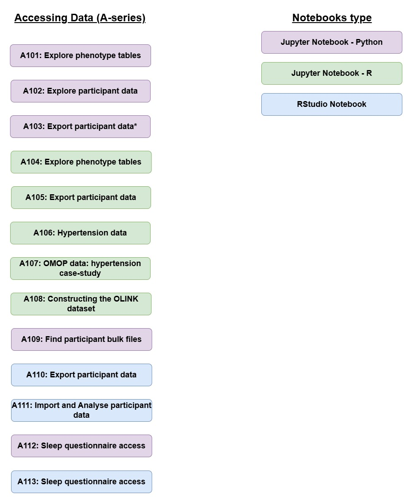

# **Accessing phenotypic data on the UK Biobank Research Analyses Platform**

The A-series (**Accessing Data**) notebooks found in this repository focus on performing basic operations to access and examine UKB phenotypic data. These give an overview of how to link and manipulate the phenotypic databases on the RAP that are likely to be interfaced with the genomic (or other; e.g. imaging) resources. Some of the data files outputted from these A-series notebooks are required for the main analytical repositories found elsewhere on these pages.
In order to initiate these notebooks on the RAP please see instructions at the bottom of this page.

This repository also includes simple **applets** within the *dnanexus-applets* folder that give examples of the functionality available in RAP applets. DNAnexus have [documentation and tutorials on applet building](https://documentation.dnanexus.com/developer/apps) available.

# A-series Notebooks 

### 

### Please note

-   When working with phenotypic data in a Jupyter notebook a Spark cluster is often required (see *Table of Contents* for guidance)

-   Always terminate a kernel before starting a new notebook

-   There is no set duration for an RStudio session, make sure to terminate it when the analysis is done

### 

## **Table of contents**

A101 Explore phenotype tables (language = Python; instance = Spark)

A102 Explore participant data (Python; Spark)

A103 Export participant data (Python; Spark)

A104 Explore phenotype tables (R; Single Node)

A105 Export participant data to R (R; Spark)

A106 Hypertension data (R; Spark)

A107 OMOP data: hypertension case-study (R; Spark)

A108 Constructing the OLINK dataset (R; Spark)

A109 Find participant bulk files (Bash; Python)

A110 Export participant data (R; RStudio)

A111 Import and Analyse participant data (R; RStudio)

A112: Sleep questionnaire access (Python; Spark)

A113:Sleep questionnaire access (R; RStudio)

A114: Export Nightingale Metabolomics data (R; Spark)

## **Python and R libraries**

### The following Python libraries are required (guidance on installation found within Notebooks):

*scipy; dxdata; dxpy; matplotlib.pyplot; numpy; openpyxl; os; pandas; seaborn*

### The following R libraries are required:

*BSgenome.Hsapiens.UCSC.hg38; GenomicRanges; SNPlocs.Hsapiens.dbSNP155.GRCh38; TxDb.Hsapiens.UCSC.hg38.knownGene; VariantAnnotation; VennDiagram; arrow; bigparallelr; bigsnpr; dplyr; dxdata; ggplot2; gprofiler2; grid; hexbin; parallel; readr; readxl; reticulate; scales; skimr; tidyr; tidyverse; sparklyr; data.table; stringr; glue; DBI; purrr; bit64*

# **Notebooks details**

## A101 Explore phenotype tables (Python; Spark)

**Scope:** This notebook explains how to connect to the phenotypic database and retrieve information about available tables (using Python). It describes the basics of connecting to phenotype databases and exploring tables and fields. We will use a `dxdata.connect` function to initiate a connection to the database. Next, we will learn how to obtain the project and dataset IDs required to load a dataset. We will iteratively throw the tables in the dataset and obtain a short description of each table. Finally, we will retrieve the information from one of these tables to local memory, inspect the content, and print a few rows of the data.

**Notebook file:** JupyterNotebook_Python/A101_Explore-phenotype-tables_Python.ipynb

**Dependency**

-   A Spark instance

**Run info:**

-   runtime: 5min

-   recommended instance: mem1_ssd1_v2_x8

-   cost: \<£0.10

## A102 Explore participant data (Python; Spark)

**Scope:** This notebook explains how to explore phenotypic data table and retrieve fields. We will dive deeper into the phenotypic data stored in the Spark database. We will retrieve the information about the fields, and learn how to get a field id, title, and link to the UK Biobank Showcase, which provides more details and basic statistics about fields.

**Notebook file:** JupyterNotebook_Python/A102_Explore-participant-data_Python.ipynb

**Dependency**

-   A Spark instance

**Run info:**

-   runtime: 10min

-   recommended instance: mem1_ssd1_v2_x8

-   cost: \<£0.10

## A103 Export participant data (Python; Spark)

**Scope:** Retrieve fields from phenotypic table and export them to CSV and XLSX files. In this notebook, we will combine commands and routines from previous notebooks.The goal is to find and retrieve selected fields from the phenotype database. Then we will export this data to CSV and Excel files - this is useful for further analyses and necessary for creating input files for tools like PLINK and REGENIE. Further information can be found in Research Analysis Platform documentation: <https://dnanexus.gitbook.io/uk-biobank-rap/working-on-the-research-analysis-platform/using-spark-to-analyze-tabular-data>

**Notebook file:** JupyterNotebook_Python/A103_Export-participant-data_Python.ipynb

**Dependency**

-   A Spark instance

**Run info:**

-   runtime: 10min

-   recommended instance: mem1_ssd1_v2_x8

-   cost: \<£0.10

## A104 Explore phenotype tables (R; Single Node)

**Scope:** This notebook shows how to connect to the Spark database in R. This notebook describes the basics of connecting to phenotype databases and exploring tables and fields. We will use the `reticulate` R package to connect to Python and call the `dxdata.connect` function, which connects to the Spark database. Next, we will learn how to convert Python (data frames) objects to R objects (tibble) and work with them using `dplyr` package. We will browse available tables and get a short description of each. Finally, we will iteratively throw all field descriptors in the `participant` table, retrieve the file codings, and save all this information to a CSV file.

**Notebook file:** JupyterNotebook_R/A104_Explore-phenotype-tables_R.ipynb

**Dependency**

-   **NA**

**Run info:**

-   runtime: 15min

-   recommended instance: mem1_ssd1_v2_x8

-   estimated cost: \<£0.20

## A105 Export participant data to R (R; Spark)

**Scope:** This notebook shows how to retrieve and export phenotypic and record table data in R and explains how to retrieve and save data for further analyses, such as genome-wide association studies or epidemiological studies. We will access [record table](https://biobank.ctsu.ox.ac.uk/crystal/docs.cgi?id=3) data using `Sparklyr` R package which connects to the Spark database. To access the phenotypic data we will use the `reticulate` R package to connect to Python and call the `dxdata.connect` function, which connects to the Spark database. Next, we will convert a Python (Spark data frame) object to an R object (tibble) and export data to a tabular text file. This file can be used as an input to external tools, such as PLINK or REGENIE.

**Notebook file:** JupyterNotebook_R/A105_Export-participant-data_R.ipynb

**Dependency**

-   A Spark instance

**Run info:**

-   runtime: 20min

-   recommended instance: mem1_hdd1_v2_x8

-   estimated cost: \<£0.30

## A106 Hypertension data (R; Spark)

**Scope:** This notebook is a more advanced version of notebook **A105** "Export participant data to R". In addition to fetching phenotypic data, we will investigate how to work with different sources and types of phenotypic data. The goal is to retrieve phenotypic annotations that we will use to perform GWAS (notebook **G203**) and PRS (notebook **G205**) studies of hypertension. We will use four sources:

-   Non-cancer illness code, self-reported

-   Diagnoses - ICD10

-   Underlying (primary) cause of death

-   Blood pressure measurement during the interview (systolic and diastolic)

Next, we examine and visualize the data -- the empirical probability densities for systolic and diastolic blood pressures for self-reported hypertension vs. non-affected and systolic and diastolic as scatter plots with the colour-coded condition. We will also apply CDC blood pressure level cut-offs to find which patients measured above the high blood pressure (hypertension) threshold during the interview. Next, we will visualise the overlap between three sources of information (self-reported, ICD10 diagnoses and diastolic blood pressure) on the Venn diagram. Finally, we will prepare tabular file formats that will be input for further analyses.

**Notebook file:** JupyterNotebook_R/A106_Hypertension-data_R.ipynb

**Dependency**

-   A Spark instance

**Run info:**

-   runtime: 20min

-   recommended instance: mem1_ssd1_v2_x16

-   estimated cost: \<£0.30

## A107 OMOP data: hypertension case-study (R; Spark)

**Scope:** This notebook performs similar analysis to Notebook **A106**. In addition to analysing hypertension within OMOP data, we will investigate how different OMOP tables interact and how to use spark within R to perform analysis on large tables. The Observational Health Data Science and Informatics community developed the Observational Medical Outcomes Partnership (OMOP) Common Data Model, which is a standardised healthcare data model. OMOP is designed to standardise the structure and content of observational data and enable efficient analyses. The goal of the notebook is to demonstrate methods described for finding, extracting, and classifying hypertension data from the OMOP data. This notebook uses three sources: 

- OMOP condition occurrence 
- OMOP Person
- OMOP concept resources

**Notebook file:** JupyterNotebook_R/A107_OMOP-data-hypertension-case-study_R.ipynb

**Dependency**

-   A Spark instance

**Run info:**

-   runtime: 10min

-   recommended instance: mem1_ssd1_v2_x16

-   cost: \<£0.10

## A108 Constructing the OLINK dataset (R; Spark)

**Scope:** This notebook demonstrates how to extract all the Olink instance tables, relevant  resources and data fields and how to join them all together to create a single dataset using R.

**Notebook file:** JupyterNotebook_R/A108_Constructing-the-Olink-dataset_R.ipynb

**Dependency**

-   A Spark instance

**Run info:**

-   runtime: 15min

-   recommended instance: mem1_hdd1_v2_x16

-   cost: \<£0.50

## A109 Find imaging bulk files (Bash; Python)

**Scope:** This notebook provides an example of how to identify participants with a bulk imaging field and download these files to an instance. This notebook uses bash and python

**Notebook file:** JupyterNotebook_Python/A109_Find-imaging-bulk-files.ipynb

**Dependency** 

- **NA**

**Run info:**

- runtime: ~20 minutes

- recommended instance: mem1_ssd1_v2_x8

- cost: ~£0.05

## A110 Export participant data (R; RStudio)

**Scope:** This RStudio notebook uses table exporter to export participant data using R. It provides a step-by-step guide, from selecting the fields of interest to running table-exporter and extracting the data into a csv format. In addition to the list fields you want to extract, you can provide the categories that include the complete list of fields you are interested in. The notebook imports the category and fields schema present in the Showcase metadata folder on the RAP and finds the fields associated with the category of interest. It reformats the field ids to a suitable input for table-exporter and uploads the file onto the project. Table-exporter is a job that is run separately from the RStudio session. It can be run from the GUI (from the Tools library) or from the Command line. The notebook calls table-exporter from the RStudio session. The data extracted can be then found in the project space. This notebook uses R and run table-exporter.

**Notebook file:** RStudio/A110_Export_participant_data.Rmd

**Dependency** 

- **Table-exporter job**

**Run info:**

- runtime: 5 minutes (+ 10 minutes for Table Exporter job)

- recommended instance: mem1_ssd1_v2_x8

- cost:  \< £0.10 (+ \< £0.10 for Table Exporter job)

## A111 Import and Analyse participant data (R; RStudio)

**Scope:** This RStudio notebook covers the essential steps for initiating an RStudio session, importing and reading data exported from the other notebooks. It also provides some useful tips for running an RStudio session and some code examples to help explore the UKB data. This notebook uses tabular participant data extracted in the project space.

**Notebook file:** RStudio/A111_Import_Analyse_participant_data.Rmd

**Dependency** 

- Extracted participant data in the project space.

**Run info:**

- runtime: 10 minutes

- recommended instance: mem1_ssd1_v2_x8

- cost:  \< £0.10

## A112 Sleep questionnaire access (Python; Spark)

**Scope:**  
This notebook demonstrates how to explore and extract phenotypic sleep questionnaire fields from the **participant data entity**. It covers both:

- The **table exporter method** (including handling of raw vs. replaced coding for fields 30549–30554), and  
- The **Spark retrieval method** using `dxdata.connect`.

It includes:

- Identification of sleep questionnaire-related field titles and field IDs  
- Preparation of a field list for the table exporter  
- Retrieval of coded and raw values  
- Exporting to a CSV file

> **Note:** Fields **30549–30554** have a known **"replace" encoding issue**, so this notebook exports **raw coded values** (i.e., encoded values). These can be accurately mapped to their corresponding meanings using the `esimpint.tsv` file.

**Notebook path:**  
`JupyterNotebook_Python/Access-guides-to-specific-datasets/A112_Sleep_Questionnaire_Access.ipynb`

**Dependency**

-   A Spark instance

-   Table exporter job

**Run info:**

-   runtime: 15 minutes

-   recommended instance: mem1_ssd1_v2_x8

-   cost: \<£0.30

## A113 Sleep questionnaire access (R; RStudio)

**Scope:**  
This RStudio notebook demonstrates how to explore and extract phenotypic sleep questionnaire fields from the **participant data entity**. It mirrors the **A112 Python table exporter approach**, using the `field.tsv` metadata to:

- Identify sleep questionnaire-related fields  
- Generate a list of fields to be inputted to the table exporter  
- Run the table exporter to extract the data

> **Note:** Fields **30549–30554** have a known **"replace" encoding issue**, so this notebook exports **raw coded values** (i.e., encoded values). These can be accurately mapped to their corresponding meanings using the `esimpint.tsv` file.

**Notebook path:**  
`RStudio/Access-guides-to-specific-datasets/A113_Sleep_Questionnaire_Access.Rmd`

**Dependency** 

-   Table exporter job

**Run info:**

- runtime: 5 minutes (+ 10 minutes for Table Exporter job)

- recommended instance: mem1_hdd1_v2_x8

- cost:  \< £0.10 (+ \< £0.10 for Table Exporter job)

## A114 Export Nightingale Metabolomics data (R; Spark)

**Scope:**  
This notebook demonstrates how to extract and consolidate all relevant NMR Metabolomics data from the database into a single dataset using R. It builds on **A105_Export-participant-data_R.ipynb** but is tailored specifically for **Nightingale data**. The notebook accesses three data categories:

- **Category 220:** 251 metabolomic biomarkers (e.g. field 23474: 3-Hydroxybutyrate)
- **Category 221:** QC warnings associated with individual data points (e.g. field 23774)
- **Category 222:** Sample-level processing metrics (e.g. field 20282: Processing Batch)

> **Note:** If you are extracting all NMR Metabolomics data (with all QC metrics), the final dataset should contain ~500,000 rows (participants) and 790 columns.

**Notebook path:**  
 `JupyterNotebook_R/A114_Export_Nightingale_Metabolomics_data_R.ipynb`

**Dependency** 

-  A Spark instance

**Run info:**
- runtime: < 15 minutes
  
- recommended instance: mem1_hdd1_v2_x16

- cost: <£2.00

### 

## How to run Jupyter notebooks on the RAP

Follow the steps below to run this Jupyter Notebook:

-   Login to the RAP: https://ukbiobank.dnanexus.com/panx/projects
-   Click on the Tools menu and select "JupyterLab"
-   Click on the "New JupyterLab" button to start a JupyterLab instance.
-   Select a name and a project from the dropdown menu for your JupyterLab environment.
-   Select the priority for your JupyterLab environment; "High" is recommended.
-   Under "Cluster Configuration", select "Single Node" or "Spark" according to requirements listed in *Table of Contents*.
-   Set instance type (e.g. mem1_sdd1_v2_x16) and duration for you environment. See individual notebooks for recommendations.
-   Click on "Start Environment"
-   You will see your environment go from "Initialising" to "Launching" and then "Ready". This may take some time depending on the priority selected; at busy times, it may be necessary to select high priority to avoid long initialising times. Once the environment is ready, click on "Open".
-   A JupyterLab session will open. On the left side of the screen, you will see a a "DNA Nexus" tab, allowing you to open notebooks directly from your project environment. If you have saved this notebook under you project environment, just double click to open it.
-   Press "Ctrl" + "Enter" to run code cells. An hourglass icon on the JupyterLab tab in your browser indicates that the code is running. Please note that depending on number of chromosomes and SNPs and your instance type, code may take some time to run.

## How to run RStudio notebooks on the RAP

Follow the steps below to run this RStudio Notebook:

-   Login to the RAP: https://ukbiobank.dnanexus.com/panx/projects
-   Click on the Tools menu and select "RStudio"
-   Click on the "New RStudio" button to start an RStudio instance.
-   Select a name and a project from the dropdown menu for your RStudio environment.
-   Select the priority for your RStudio environment; "High" is recommended.
-   Set instance type (e.g. mem1_sdd1_v2_x8). **N.B.** For an RStudio session, you can't set a specific duration, you need to terminate the session yourself a the end of the analysis to avoid incurring costs.
-   Click on "Start Environment"
-   You will see your environment go from "Initialising" to "Launching" and then "Ready". This may take some time depending on the priority selected; at busy times, it may be necessary to select high priority to avoid long initialising times. Once the environment is ready, click on "Open".
-   On the new page, click on "New Session" and select a name for the session. You can open multiple sessions with one environment.
-   An RStudio session will open. If you have saved your notebook under your project environment, you can import it into your session using the terminal by typing [`dx download`](https://documentation.dnanexus.com/user/objects/uploading-and-downloading-files/small-sets-of-files/downloading-using-dx) followed by the file-ID of the notebook (you can find the file-ID in your project space, when selecting the notebook, on the right-side panel showing the file properties).
- The downloaded notebook will show up on the lower-right side panel under files. Please note that you RStudio environment is separate from your project space, so the files you are working on during your session need to be uploaded to your project before terminating the session. This can be done using [`dx upload`](https://documentation.dnanexus.com/user/objects/uploading-and-downloading-files/small-sets-of-files/uploading-using-dx) in the terminal.

# Applets

**spark-example-applet:** This applet takes as an input a field id (in DNAnexus format, e.g. participant.p31) and outputs the mean for that field. It is intended as a test/example of a applet enabled to access the Spark dataset within the project the applet is built in. 

`dx run spark-example-applet -ifield_id=participant.p31`

Additional information on the applet can be found in its corresponding folder within the **dnanexus-applets** folder.

## How to build and run an existing applet

1. Login to DNx via the command line using `dx login`
2. Select the project you wish to build the applet in using `dx select`
3. Build the applet using `dx build -a <applet directory>`
4. Run the applet using `dx run <applet name> -i<input name>=<input>`. Alternatively use `dx run <applet name>` and you will be prompted to enter inputs.

